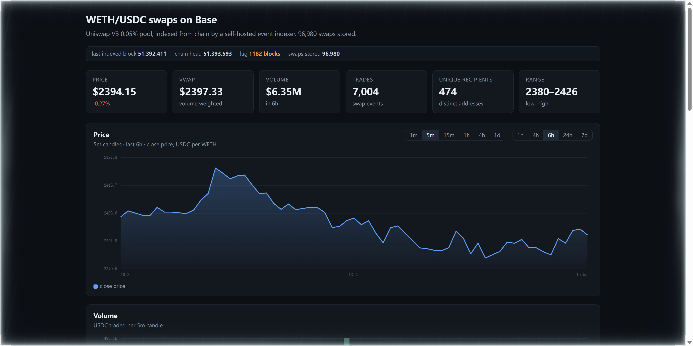

# base-swap-indexer

[](https://github.com/hareeshkashyap849/base-swap-indexer/actions/workflows/ci.yml)
[](LICENSE)

Indexes every swap on a Uniswap V3 WETH/USDC pool on **Base mainnet**, stores
them in SQLite, and serves them through a REST API and a dashboard.

**Pool:** `0xd0b53D9277642d899DF5C87A3966A349A798F224` (WETH/USDC, 0.05% fee)
**Chain:** Base mainnet (8453) · **Access:** read-only, no wallet, no keys



*The dashboard as it renders against the database described below — 96,980 swaps over a 200,000-block
window, indexed from chain by this project. The header line is the index reporting its own lag, which
is the number that decides whether the rest of the page is worth reading.*

```bash
npm install
npm run index      # backfill 10,000 blocks (~2 min)
npm run api        # http://127.0.0.1:3001
```

Then open **http://127.0.0.1:3001/** for the dashboard.

Requires **Node 22.6+**. No compiler, no Docker, no database server, no front-end
build.

### Starting and stopping the API on Windows

Use these instead of `npm run api`:

```powershell
node tools\serve.mjs              # start
node tools\kill-api.mjs           # stop whatever holds the port
node tools\kill-api.mjs --list    # just show who holds it
```

**Why not `npm run api`.** `npm.cmd` is a batch wrapper: on Windows Ctrl+C is
delivered to that batch file rather than to the node process it started. npm
exits, node survives, the port stays held, and every later start fails with
`EADDRINUSE` while the terminal looks impossible to stop. `tools/serve.mjs`
spawns the server in-process, so Ctrl+C reaches something that acts on it.

`kill-api.mjs` finds the holder with `netstat -ano` rather than
`Get-NetTCPConnection`, because measured here the cmdlet reported no listener on
a port that was demonstrably in use. If `taskkill` is refused, the holder is
running with higher privileges than your shell — open Task Manager as
administrator and end that node.exe, or simply use another port:

```powershell
$env:PORT=3002; node tools\serve.mjs
```

Nothing in the project hardcodes 3001.

### Checking the dashboard in a real browser

The dashboard is verified headlessly (`npm run smoke:dashboard`), but browser
layout is the one thing a headless harness models rather than measures. To check
it for real:

1. Start the server and open the dashboard.
2. Open **http://127.0.0.1:3001/diagnose** in a second tab — that serves the
   snippet as plain text.
3. Select all, copy, switch to the dashboard tab.
4. F12 → Console → paste → Enter. It waits ~20 s so the auto-refresh fires, then
   reports whether the canvas layout width changed.

The snippet is served over HTTP rather than handed over as a file because asking
someone to open a `.js` file and copy it is a step where the wrong thing gets
selected: pasting the *path* `tools/diagnose-in-browser.js` into a console fails
with `SyntaxError: Unexpected token 'in'` — the `-in-` in the filename. A URL
cannot be mis-copied.

---

## What this actually does

```
Base RPC ──getLogs──▶ Indexer ──decode──▶ SQLite ──SQL──▶ API ──▶ Dashboard
   │                     │
   │              adaptive chunking
   │              checkpoint / resume
   │              reorg detection
   └─ multi-endpoint rotation with learned capabilities
```

A measured run over 10,000 blocks: **8,668 swaps** indexed in ~4.6 minutes,
priced between **$2,436 and $2,486** per WETH.

---

## Why it is built this way

### Public RPC endpoints are hostile, so the code assumes it

Every constraint below was measured against live Base mainnet, not assumed:

| Observation | Consequence in the code |
|---|---|
| A ~10 MB response fails outright; wide `eth_getLogs` ranges are rejected | Chunk size **adapts** instead of being fixed |
| Log density varies **175×** over the same span of chain (55 logs in one 50-block chunk, 9,616 in another) | Growth is additive on success, halving on failure — a fixed size cannot work |
| 6 concurrent `eth_call` requests trip the rate limiter | Multi-endpoint rotation with backoff |
| `base.drpc.org` returns a correctly-sized batch reply with every `timestamp` field **silently missing** | Batch replies are **validated field-by-field**, not counted |
| `mainnet.base.org` rejects batches with `-32014` | The pool **learns** which endpoints cannot batch and stops asking them |

That last pair is the interesting one. Counting results would have accepted
drpc's reply and written `timestamp = 0` for every swap — a chart that renders
fine and is confidently wrong. And without the learned-capability memo, a
10,000-block backfill burned **123 RPC calls with 59 failures**; after the fix
it used **85 calls with 21 failures** and took **half the wall-clock time**.

### Errors are never swallowed

A range that fails for a size-related reason shrinks and retries. A range that
fails for any other reason **aborts the run**. It is never skipped, because a
skipped range is invisible downstream: the dashboard would simply show fewer
trades, with nothing to indicate data was missing.

The checkpoint advances only after the data is committed, so a crash can lose
work but can never claim work that was not done.

### The token order is the whole ballgame

This pool has **token0 = WETH (18 decimals)** and **token1 = USDC (6 decimals)**.
The raw ratio `token1/token0` is therefore already *USDC per WETH*. Reading it
the other way inverts every number in the project while still producing
plausible-looking output.

Three defences:

1. `token0`/`token1` are **read from chain at startup**, not trusted from a constant.
2. Price is derived **two independent ways** — from `sqrtPriceX96` and from
   `tick` — and the two are cross-checked on every row.
3. The test suite pins the real measured value (`~2443 USDC/WETH`), so an
   inverted reading fails loudly instead of quietly.

### Zero build toolchain

Node runs the TypeScript directly via `--experimental-strip-types`.
`erasableSyntaxOnly` in `tsconfig.json` guarantees the source stays strippable.

Two dependencies were removed for the reviewer's sake, not ours:

- **`better-sqlite3` → `node:sqlite`.** The native module installs through
  node-gyp, which needs a compiler toolchain; requiring one would defeat
  "clone and run".
- **`tsx` → `node --experimental-strip-types`.** tsx spawns an esbuild service.

Runtime dependencies are **viem** and **fastify**, nothing else. Tests use the
built-in `node:test` runner, so there is no test framework either.

### The dashboard needs no build

The dashboard is a single self-contained HTML file with hand-drawn canvas charts,
served by the API at `/`. Opening it requires no `npm install`, no bundler and no
toolchain.

There is deliberately no framework front end. A React + Vite version was written
first and removed: it could not be built in the environment this project was
developed in, so its production build was never verified, and an unverifiable
component is worse than an absent one — it makes "which front end is real?" a
question the README has to answer. What remains is the version that was actually
run end to end, and it is asserted by `npm run smoke:dashboard`.

---

## Verified behaviour

Run it yourself:

```bash
npm run verify          # typecheck + 72 tests in 6 files
```

```
typecheck              strict, plus noUncheckedIndexedAccess and exactOptionalPropertyTypes
chunker.test.ts   20   adaptive sizing, and exact coverage (INV-2)
price.test.ts     15   derivation maths, the direction trap, sign convention (INV-6)
api.test.ts       14   response shapes, aggregation agreement (INV-5), malformed input (F12)
backfill-config.test.ts  9    the endpoint override and the chunk-size flags a bulk run needs
rpc-pool.test.ts         7    endpoint bookkeeping, against a local stub HTTP server
discovery.test.ts        7    fixture discovery
```

`rpc-pool.test.ts` runs a **real HTTP server on localhost** rather than mocking `fetch`, because what
it tests is how the pool behaves when an endpoint answers with a real status and a real body. It was
written against two defects that cost a measured 200,000-block backfill about twenty hours of
avoidable work: a rate limit was remembered as "this endpoint cannot serve batches" (removing the only
batch-capable endpoint from the rotation for the rest of the run), and an HTTP `429` was read as a
statement about the endpoint's capabilities rather than about the current second. Both are now pinned
by tests that fail if the distinction is lost again.

Plus a data audit against the indexed database:

```bash
node --experimental-strip-types verify-data.ts --db data/swaps.sqlite --against-chain 20
```

The last full run of both halves, against the 200,000-block window described above:

```
rows in db: 96980
  INV-3 price cross-check on 300 rows: PASS
      price range seen: 2361.20 .. 2601.51 USDC per WETH
  price magnitude is plausible for this pair: PASS  (2361..2602)
  INV-6 sign consistency: PASS
  timestamp sanity: PASS
      time span: 2026-09-12T00:49:33.000Z .. 2026-09-16T15:56:09.000Z
  both trade directions present: PASS  (buy WETH=50112, sell WETH=46868)
  INV-5 SQL vs JS volume agreement: PASS  (JS 77685103.82 vs SQL 77685103.82)

  chain cross-check on 20 sampled blocks (external ground truth)
  every stored field matches the chain on 40 swaps across 20 blocks: PASS
      (amounts, sqrtPriceX96, liquidity, tick, sender and recipient)
all data checks passed
```

### Scale, and where the limit actually is

The database these numbers come from holds **96,980 swaps spanning exactly 200,000 blocks**
(51,192,413 → 51,392,411, i.e. 2026-09-12 to 2026-09-16), indexed from chain in **37 minutes**. The API
serves it directly:

```
GET /api/stats?hours=120
  {"trades":96980, "volumeUsdc":77685103.81502175, "vwap":2463.4617383324494,
   "uniqueTraders":2801, "firstBlock":51192413, "lastBlock":51392411,
   "low":2359.2114541627666, "high":2613.8638348029644}
```

**The bottleneck is the endpoints, not the code, and that is measurable rather than a claim.** The log
scan is 100 requests of 2,000 blocks; the header fetch needs one header per block containing a swap
(53,467 of them here) and only a batching endpoint makes that affordable. The first attempt at this
window ran the header phase at **1.7 blocks/s** — about twenty hours — and the cause was three defects
in this repository, all now fixed and pinned by tests:

| Defect | What it did |
|---|---|
| every batch failure was remembered as "this endpoint cannot serve batches" | one rate limit removed the only batch-capable endpoint from the rotation for the rest of the run |
| an HTTP `429` was read as a capability statement | the same thing, one layer down: the status was not consulted before the body |
| the header cache started empty every run | every header was re-fetched on every pass, although all of them were already in the `blocks` table |

With those fixed the phase measured **20 blocks/s** — and then stopped, because that was the ceiling of
the single usable endpoint. The fix for that was not in the code either: `tools/probe-endpoints.mjs`
found two more hosts that serve batches, and the same phase then ran at **40 blocks/s** and reused
29,470 of the 53,467 headers it had already fetched. What remains is a genuinely external limit: three
batch-capable endpoints at roughly 20 headers/second each.

And a headless smoke test for the dashboard, which needs the API running:

```bash
npm run api &
npm run smoke:dashboard
```

It renders the dashboard's real script against a minimal DOM, records every
canvas call, and asserts the geometry is not degenerate. That check exists
because of a real bug: the chart code read `.price` and `.volume` from candles
that only had `.close` and `.volumeUsdc`, so every Y coordinate was `NaN` and
both charts silently drew nothing — no exception, no console error. Neither the
typechecker nor the unit tests can see that, since the dashboard is plain JS
inside an HTML page. It is now covered in CI.

### Invariants the tests encode

| # | Invariant | Why it matters |
|---|---|---|
| INV-1 | Re-indexing a range changes nothing | A non-idempotent indexer double-counts volume |
| INV-2 | Chunking covers the span exactly, no gaps or overlaps | A gap is a **silent** error |
| INV-3 | `sqrtPriceX96` and `tick` derivations agree | Catches a token-order or RPC-data error |
| INV-4 | No rows survive from an abandoned block after a reorg | Reorgs are the most commonly ignored correctness problem |
| INV-5 | Aggregates equal the rows they summarise | Catches a wrong `WHERE` or `GROUP BY` |
| INV-6 | `sign(amount0) = -sign(amount1)` | A violation means the event was decoded wrong |

---

## API

| Endpoint | Purpose |
|---|---|
| `GET /` | Dashboard (or a JSON service description if the file is absent) |
| `GET /api/health` | Indexer freshness: last indexed block, chain head, lag |
| `GET /api/swaps?limit=&beforeBlock=&beforeLogIndex=` | Recent swaps, newest first |
| `GET /api/ohlcv?interval=&hours=&maxCandles=` | OHLCV candles |
| `GET /api/stats?hours=` | VWAP, volume, trade count, unique traders, range |

```bash
curl 'http://127.0.0.1:3001/api/stats?hours=6'
curl 'http://127.0.0.1:3001/api/ohlcv?interval=5m&hours=2'
```

Malformed input returns `4xx`, never `500`:

```
GET /api/swaps?limitt=5      → 400  querystring must NOT have additional properties
GET /api/swaps?limit=99999   → 400  querystring/limit must be <= 500
```

That first case is deliberate. Fastify's default AJV configuration sets
`removeAdditional: 'all'`, which **silently deletes** unknown parameters — a
client misspelling `limit` would get a `200` with defaulted data and no signal
that anything was wrong. Disabling it turns typos into errors.

---

## Indexer CLI

```
npm run index                     backfill 10,000 blocks and exit
npm run index -- --blocks 500     smaller window
npm run index -- --reindex        ignore the saved checkpoint
npm run index:follow              backfill, then keep polling
```

### Indexing a large historical window

A big backfill is limited by the endpoints, not by this code, and the limit is measurable. Only one
of the three default endpoints will serve a historical range at all — so **measure that first**, then
tell the indexer what it can rely on:

```bash
node --experimental-strip-types tools/probe-rpc-range.mjs      # who will answer, and how far back

node --experimental-strip-types src/indexer/cli.ts \
  --blocks 200000 --chunk-max 2000 --chunk-initial 2000 \
  --db data/swaps-scale.sqlite
```

Measured 2026-09-16, 2,000-block windows requested from four distances behind the head:

| Endpoint | head-1k | head-50k | head-100k | head-250k |
|---|---|---|---|---|
| `mainnet.base.org` | 1,578 logs | 926 | 840 | 1,310 |
| `base-rpc.publicnode.com` | 1,578 | `Archive requests require a personal token` | same | same |
| `base.drpc.org` | `ranges over 10000 blocks are not supported on free plan` | same | same | same |

Two consequences worth knowing before a long run starts:

- **`--chunk-max` exists because the adaptive chunker is wrong for this job.** It starts at 50 and
  grows by 10, which is how it discovers an unknown limit — but here the limit is known (2,000), and
  a 200,000-block window at the default maximum of 500 needs at least 400 calls. Passing the measured
  limit in makes the first chunk the right size.
- **Restricting to one endpoint with `BASE_RPC_URLS` breaks the startup check.** The pool needs to
  rotate: `mainnet.base.org` rate-limits after a handful of `eth_call`s (measured: the identity
  check's seven reads trip it), and with a single endpoint there is nowhere to rotate to. Leave the
  default list in place; the historical pulls will land on the endpoint that can serve them, at the
  cost of a failed call per chunk first.

### Verifying what was indexed

```bash
node --experimental-strip-types verify-data.ts --db data/swaps-scale.sqlite
node --experimental-strip-types verify-data.ts --db data/swaps-scale.sqlite --against-chain 20
```

The first form is offline and checks the database against itself: two independent price derivations,
opposing signs, plausible timestamps, both trade directions, and SQL-vs-JS volume agreement. The
second **re-reads sampled blocks from a public RPC and compares every stored field** — amounts,
`sqrtPriceX96`, liquidity, tick, sender, recipient — decoding with viem directly rather than with
this project's own decoder, because running our decoder twice proves it is deterministic rather than
correct. That is the only check here that can catch a consistently wrong database.

### The real ceiling on a large backfill

A big backfill has two phases with very different bottlenecks, and the second one is not this code's
to fix. `tools/probe-batch-size.mjs` measures it:

```bash
node --experimental-strip-types tools/probe-batch-size.mjs
```

Measured 2026-09-16, asking each endpoint for batches of block headers:

| Endpoint | 50 | 200 | 500 | 1000+ | Conclusion |
|---|---|---|---|---|---|
| `base-rpc.publicnode.com` | 5.5 s | 11.4 s | 23.9 s | times out | the only one that serves batches, at ~**20 headers/second** regardless of size |
| `mainnet.base.org` | `-32014 maximum 1 request in batch` | same | same | same | cannot batch at all |
| `base.drpc.org` | `Batch of more than 3 requests` (HTTP 500) | same | same | same | cannot batch usefully |

A 200,000-block window needs roughly **86,000 headers** (about 43% of blocks contain a swap), so at
20/second the header phase alone is **about 72 minutes**. That is the endpoint's throughput, not the
program's: the run measures at ~16.7 headers/s, which is ~84% of what the probe says is available.

The batch size of **200** is therefore a measurement, not a guess: 500 works but takes 23.9 s against
the batch path's 30 s timeout, which leaves no margin on a slow day.

If a much larger index is ever wanted, the lever is **more batch-capable endpoints**, not a larger
batch — and the honest version of that claim is "more distinct public RPC hosts", which is a
different piece of work from anything in this repository.

---

## Layout

```
src/indexer/     chunker (adaptive sizing) · indexer (fetch, decode, reorg) · cli
src/lib/         price maths · RPC pool · SQLite store · read queries
src/api/         fastify server and routes
dashboard/       single-file zero-build dashboard (what the API serves)
test/            49 cases, no network, no shared state
tools/           config and lifecycle checkers
verify-data.ts   data audit run against a populated database

REQUIREMENTS.md  scope, acceptance criteria, verified facts, deviations
ARCHITECTURE.md  component design, decisions, price maths, invariants
TESTING.md       how to verify this project
```

---

## Known limitations

Stated plainly, because a portfolio project that claims none is not credible:

- **Timestamps come from block headers, not events.** Uniswap V3's `Swap` event
  carries no timestamp, so one header fetch per distinct block is required.
  Those fetches are batched.
- **Reorg handling is bounded.** Detection walks back at most 64 blocks. A
  deeper reorg is reported, not silently recovered — the code refuses to delete
  data on a guess.
- **`node:sqlite` is marked experimental** on Node 24 and prints a startup
  warning. Its API is smaller than `better-sqlite3`'s. `Store` in
  `src/lib/db.ts` is the only place the driver is used, so swapping is
  contained.
- **Public RPC endpoints have no SLA.** They rate-limit and occasionally return
  malformed data. Correctness is defended by validation and cross-checks; it is
  not guaranteed by the provider.
- **Not deployed anywhere.** This runs locally by design — there is no hosted
  instance. Saying otherwise would be a lie.
- **One pool, one chain, indexed window only.** Not a general-purpose indexer.
- **No reorg or partition test against a live chain.** Reorg recovery is
  exercised by unit-level reasoning about stored hashes, not by observing a real
  reorg. That is a genuine gap in the evidence.

---

## Design documents

- [`TESTING.md`](TESTING.md) — how to verify this project, in four levels, plus
  what is deliberately **not** covered
- [`REQUIREMENTS.md`](REQUIREMENTS.md) — verified facts about the pool and the
  RPC endpoints, scope, acceptance criteria, explicit non-goals, and where the
  implementation deviates from the original specification
- [`ARCHITECTURE.md`](ARCHITECTURE.md) — component design, trust boundary,
  frozen decisions with rejected alternatives, the price derivation, the
  invariants the tests encode, failure-mode analysis

The working notes these were distilled from were written in Chinese; these
versions are in English so that a reviewer who does not read Chinese gets the
same content rather than a gap.

---

## Licence

MIT
